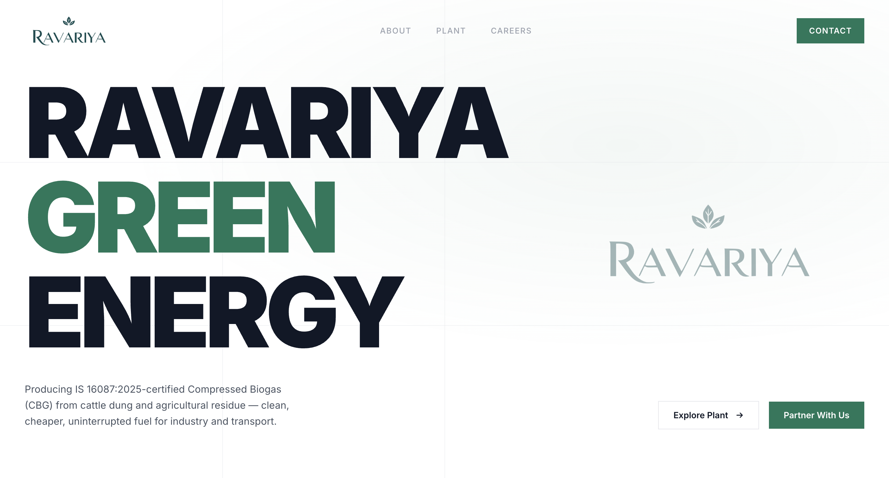
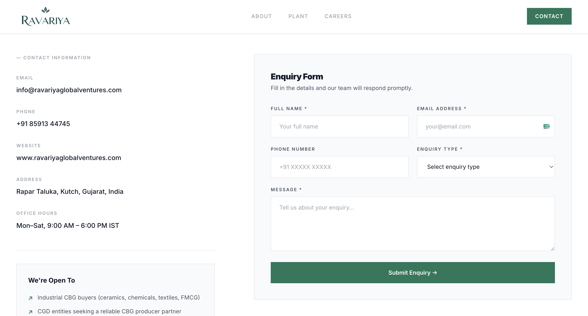
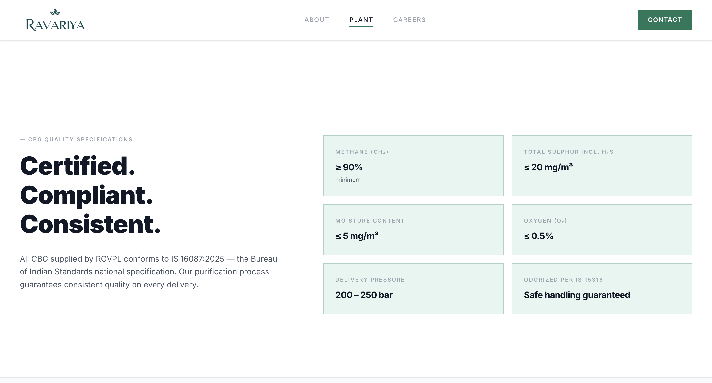

# Ravariya Green Energy

Ravariya Global Ventures Pvt. Ltd. (RGVPL) — IS 16087:2025-certified Compressed Biogas (CBG) for industry and CGD entities across Kutch, Gujarat.

## 🚀 Overview

This is a modern, high-performance web application built for Ravariya Green Energy. It serves as the primary digital presence for RGVPL, showcasing their commitment to sustainable energy through Compressed Biogas (CBG). The site is designed with smooth animations, fluid scrolling, and a fully responsive layout to provide a premium user experience.

## 🛠️ Technologies Used

- **Frontend Framework**: [React 18](https://reactjs.org/)
- **Build Tool**: [Vite](https://vitejs.dev/)
- **Routing**: [React Router v6](https://reactrouter.com/)
- **Styling**: [Tailwind CSS](https://tailwindcss.com/)
- **Animations**: [Framer Motion](https://www.framer.com/motion/)
- **Smooth Scrolling**: [Lenis](https://lenis.studiofreight.com/)
- **Typography**: [Inter Font](https://fonts.google.com/specimen/Inter)

## 📂 Project Structure

The project follows a standard React component-based architecture:

- `src/pages/` - Contains the main route components:
  - `Home`: Landing page
  - `About`: Company information
  - `Plant`: Details about the CBG plant and operations
  - `Careers`: Job openings and work culture
  - `Contact`: Contact forms and location details
- `src/components/` - Reusable UI components including:
  - `Navbar` & `Footer` for global layout
  - `SmoothScroll` & `ScrollProgress` for enhanced navigation
  - `FadeIn`, `TextReveal`, `Marquee` for text animations
  - `MagneticButton` and `CustomCursor` for interactive micro-interactions

## 📸 Screenshots

<p align="center">
  
</p>
<p align="center">
  
</p>
<p align="center">
  
</p>

## ⚙️ Getting Started

Follow these steps to run the project locally.

### Prerequisites

Ensure you have [Node.js](https://nodejs.org/) installed on your machine.

### Installation

1. Clone the repository:
   ```bash
   git clone <your-repository-url>
   cd ravariya
   ```

2. Install dependencies:
   ```bash
   npm install
   ```

### Development Server

Start the Vite development server:
```bash
npm run dev
```

The application will be available at `http://localhost:5173`.

### Building for Production

To create an optimized production build:
```bash
npm run build
```

To preview the production build locally:
```bash
npm run preview
```

## 📄 Copyright

Copyright © Ravariya Global Ventures Pvt. Ltd. (RGVPL). All rights reserved.
